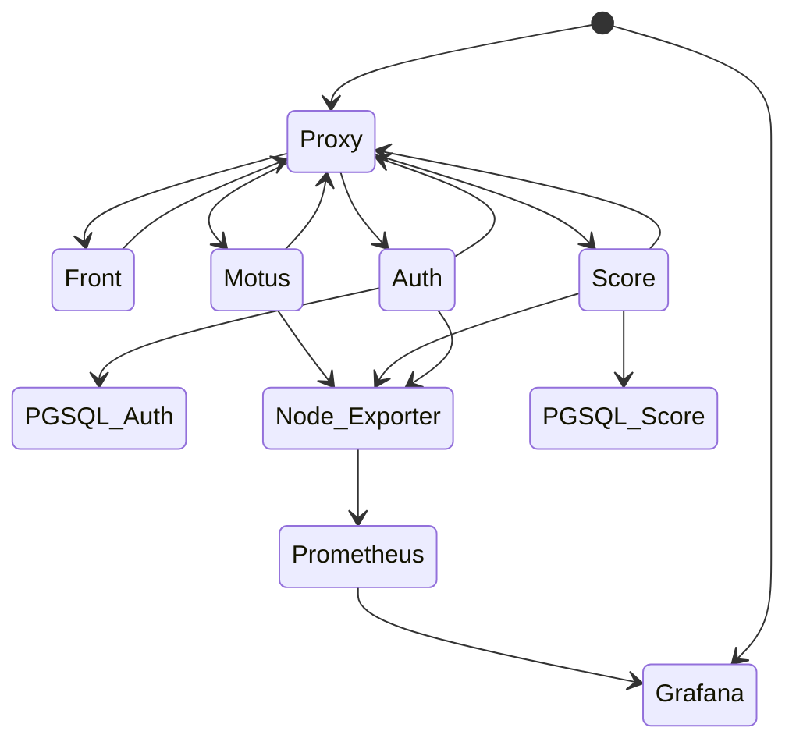
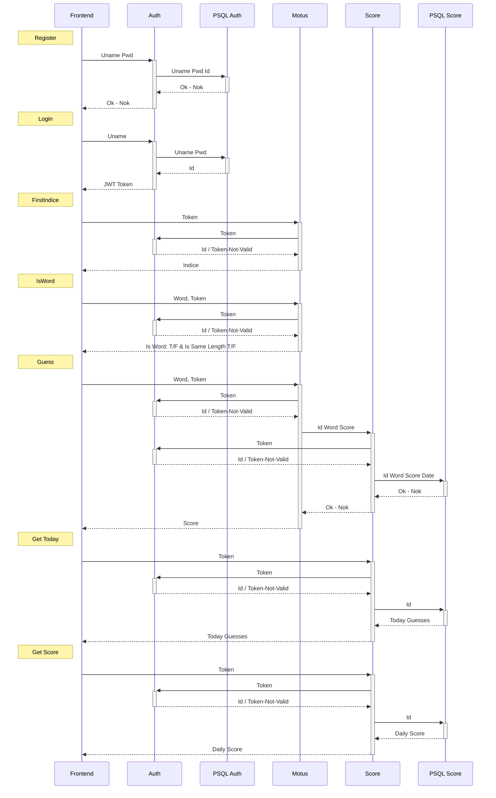

# Motusom

Motusom est un jeu inspiré du jeu [Motus](<https://fr.wikipedia.org/wiki/Motus_(jeu)>).

L'objectif de ce projet est de créer une application web mettant en oeuvre différents micro-services indépendants, connecter ces micro-services entre eux et les rendre interopérables.

Le fichier docker-compose.yml permet de lancer l'ensemble des micro-services en une seule commande.

## Structure du projet

La structure du projet est la suivante :

- `motus` : toute la logique métier du jeu Motus (serveur NodeJS + Express)
- `front` : application web (serveur Angular)
- `auth` : service d'authentification (serveur NodeJS + Express)
- `score` : service de gestion des scores (serveur NodeJS + Express)
- `auth_db` : base de données de l'authentification (serveur PostgreSQL)
- `score_db` : base de données des scores (serveur PostgreSQL)
- `proxy` : proxy qui gère les redirections (serveur HAProxy)
- `monitoring` : service de monitoring (serveur Prometheus + Grafana)

## Prérequis

- [Docker](https://www.docker.com/)
- [Docker Compose](https://docs.docker.com/compose/)

## Étapes de lancement

1. Cloner le projet

```bash
git clone https://github.com/Youplala/Motus.git
```

2. Naviguer dans le dossier du projet

```bash
cd Motus
```

3. Lancer les conteneurs

```bash
docker-compose up -d
```

4. Se rendre sur [http://localhost](http://localhost)
5. Amusez-vous !

# Architecture

L'application est composée de plusieurs Microservices repartis selon le schema suivant:



## Front

Le frontend est une application qui utilise le framework [Angular](https://angular.io/). Il est composé d'une page de connexion et d'une page de jeu.

## Proxy

Le service Haproxy permet dispacher les requêtes entre les différents services.

## Authentification

Le service d'authentification permet de gérer les utilisateurs et les sessions. Il est basé sur [Node.js](https://nodejs.org/en/) et [Express](https://expressjs.com/).
Il utilise une base de données [PostgreSQL](https://www.postgresql.org/) pour stocker les noms d'utilisateur et leur mot de passe hashé.

À chaque nouvelle connexion, un JWT (JSON Web Token) est généré. Ce token est utilisé pour vérifier l'identité de l'utilisateur lors de ses requêtes.
Ce token a une durée de vie de 1 heure. Au bout de cette durée, l'utilisateur doit se reconnecter. Le token est stocké dans le localStorage du navigateur.
Cela peut poser des problèmes de sécurité car une personne malveillante peut récupérer le token et l'utiliser pour usurper l'identité de l'utilisateur.
Cependant, le token est signé avec une clé secrète qui n'est pas stockée sur le serveur. Cela permet de s'assurer que le token n'a pas été modifié.

## Bases de données

### Score

La table Score est composée des colonnes suivantes:

- `id` : identifiant unique de l'utilisateur
- `guess` : mot proposé par l'utilisateur
- `nb_try` : compteur du nombre d'essais
- `day` : date de la partie
- `ìndice` : indice donné par le serveur

### Authentification

La table Auth est composée des colonnes suivantes:

- `id` : identifiant unique de l'utilisateur
- `username` : nom d'utilisateur
- `password` : mot de passe hashé

# Chemin Utilisateur

## Connexion
Afin de se connecter, l'utilisateur doit entrer son nom d'utilisateur et son mot de passe. Si les informations sont correctes, un token est généré et stocké dans le localStorage du navigateur. Ce token est utilisé pour vérifier l'identité de l'utilisateur lors de ses requêtes.

## Mise en place d'une partie (Non utilisateur)
Afin de mettre en place le jeu, l'application va aller chercher l'indice du mot du jour.

L'application va ensuite rechercher les essais de l'utilisateur pour ce mot. Si l'utilisateur n'a pas encore joué, il n'y aura pas d'essais.

Enfin, l'application va rechercher les scores du joueur pour toutes les parties jouées.

## Jeu

L'utilisateur doit proposer un mot.
L'application va verifier que le mot proposé est bien un mot français et qu'il a la bonne taille.
Si le mot est valide, l'application va envoyer le mot au serveur Motus qui lui renverra un indice.
Si le mot est trouvé, l'application va enregistrer le score et afficher le score du joueur, sinon elle affichera le nombre d'essais restants.


# Requêtes Api

