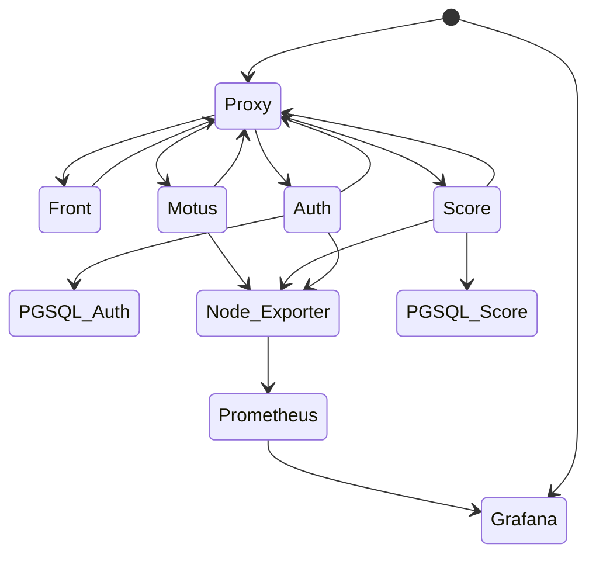
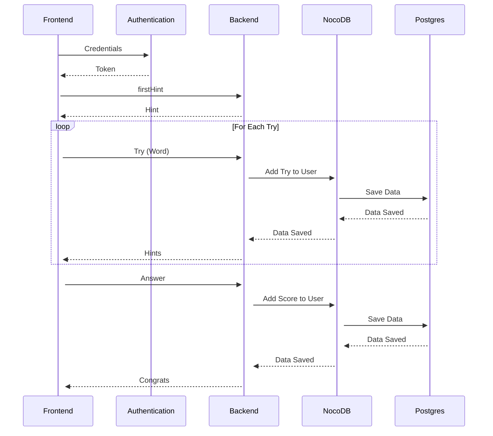

# Motusutom

L'objectif de ce projet est de créer une application web utilisant différents micro-services. L'architecture est complexe et permet de mettre en oeuvre plusieurs technologies.
Motusom est un jeu inspiré du jeu [Motus](https://fr.wikipedia.org/wiki/Motus_(jeu)).

# Architecture

L'application est composée de plusieurs Microservices repartis selon le schema suivant:

## Frontend

Le frontend est une application [Angular](https://angular.io/) qui permet la visualisation coté Client.

## Haproxy

Le service Haproxy permet de faire du load balancing entre les différents services.

## Auth

Le service d'authentification permet de gérer les utilisateurs et les sessions. Il est basé sur [Node.js](https://nodejs.org/en/) et [Express](https://expressjs.com/).

## Backend

Le service backend est un service [Node.js](https://nodejs.org/en/) qui permet de gérer les parties et les mots.

## Postgres

Postgres est la base de données utilisée par l'application.

